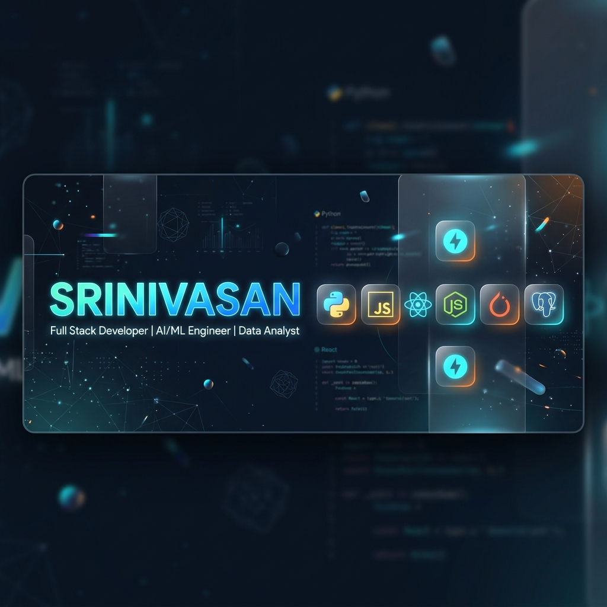

# 
Hi there, I'm Srinivasan 👋

  

  

 
 

---

## 💫 About Me

  I am a passionate <b>Full Stack Developer</b> and <b>AI/ML Engineer</b> dedicated to building intelligent systems that solve real-world problems. With a deep background in <b>Data Analytics</b> and <b>Agentic AI</b>, I specialize in creating end-to-end MLOps pipelines and highly interactive web applications.

  🔭 I’m currently working on <b>Autonomous Research Agents</b>  
  🌱 I’m currently learning <b>Advanced Reinforcement Learning</b>  
  👯 I’m looking to collaborate on <b>Open Source AI Projects</b>  
  💬 Ask me about <b>Python, React, or LangChain</b>  

 
 

---

## 🚀 My GitHub Universe

  

 

  

 

  
  

 
 

---

## 🛠️ Technical Powerhouse

### 🌐 Core Programming & Web

  
  
  
  
  
  

 

### ⚛️ Frontend & Backend Frameworks

  
  
  
  
  
  

 

### 🧠 AI, ML & Deep Learning

  
  
  
  
  
  

 

### 🤖 Agentic AI & NLP

  
  
  
  
  

 

### 📊 Data Analysis & Engineering

  
  
  
  
  

 

### 🗄️ Databases & Storage

  
  
  
  
  

 

### ☁️ DevOps & Tools

  
  
  
  
  

 
 

---

## 🌟 Major Engineered Systems

  <b>Anomaly Detection System</b>  
  <i>Real-time monitoring and detection of system irregularities using advanced ML models.</i>  
  

 

  <b>Autonomous Research Agent</b>  
  <i>An AI agent capable of performing deep-dive research and synthesizing reports autonomously.</i>  
  

 

  <b>IMAGE GENERATOR</b>  
  <i>Deep learning based image synthesis tool powered by Diffusion models.</i>  
  

 

  <b>CHAT-APP</b>  
  <i>Real-time full-stack communication platform with WebSocket integration.</i>  
  

 

  <b>Vendor Management System</b>  
  <i>Robust backend for enterprise-scale vendor tracking and automation.</i>  
  

 
 

---

## 📂 Academic & Utility Repositories

  
  
  

 

  
  
  

 
 

---

## 🐍 Contribution Snake

  

 
 

---

## 📫 Let's Connect!

  
  
  

 

  

  <i>"Code is like humor. When you have to explain it, it’s bad." – Cory House</i>

