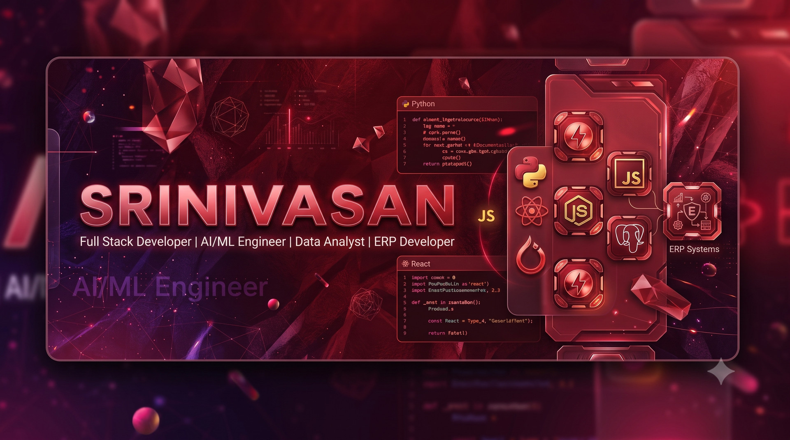

  

  

  
  
  
  

## 💫 About Me

  I'm a <b>Full Stack Developer</b> and <b>AI/ML Engineer</b> who builds intelligent systems that solve real problems — from
  end-to-end MLOps pipelines to highly interactive web applications and enterprise ERP tooling.

  🔭 Currently building <b>Autonomous Research Agents</b> 
  🌱 Currently learning <b>Advanced Reinforcement Learning</b> 
  👯 Looking to collaborate on <b>Open Source AI Projects</b> 
  💬 Ask me about <b>Python, React, or LangChain</b> 
  📫 Reach me at <b>kbcsrinivasan@gmail.com</b>

## 🚀 GitHub Universe

  

  
  

  
  

  

## 🛠️ Technical Powerhouse

### 🌐 Core Programming & Web

  
  
  
  
  
  

### ⚛️ Frontend & Backend Frameworks

  
  
  
  
  
  
  

### 🧠 AI, ML & Deep Learning

  
  
  
  
  
  

### 🤖 Agentic AI & NLP

  
  
  
  
  

### 📊 Data Analysis & Engineering

  
  
  
  
  

### 🗄️ Databases & Storage

  
  
  
  
  

### ☁️ DevOps & Tools

  
  
  
  
  
  

## 🌟 Major Engineered Systems

<table align="center">
  <tr>
    <td width="50%" valign="top">
      <h3 align="center">🔍 Anomaly Detection System</h3>
      
Real-time monitoring and detection of system irregularities using advanced ML models.

      

        
      

    </td>
    <td width="50%" valign="top">
      <h3 align="center">🤖 Autonomous Research Agent</h3>
      
An AI agent that performs deep-dive research and synthesizes reports autonomously.

      

        
      

    </td>
  </tr>
  <tr>
    <td width="50%" valign="top">
      <h3 align="center">🎨 Image Generator</h3>
      
Deep learning based image synthesis tool powered by diffusion models.

      

        
      

    </td>
    <td width="50%" valign="top">
      <h3 align="center">💬 Chat App</h3>
      
Real-time full-stack communication platform with WebSocket integration.

      

        
      

    </td>
  </tr>
  <tr>
    <td width="50%" valign="top">
      <h3 align="center">📦 Vendor Management System</h3>
      
Robust backend for enterprise-scale vendor tracking and automation.

      

        
      

    </td>
    <td width="50%" valign="top">
      <h3 align="center">🖥️ Portfolio Site</h3>
      
React and Tailwind portfolio with Framer Motion animations, deployed on Vercel.

      

        
      

    </td>
  </tr>
</table>

## 📂 Academic & Utility Repositories

  
  
  
  
  
  

## 🐍 Contribution Snake

  

## 📫 Let's Connect

  
  
  

  <i>"Code is like humor. When you have to explain it, it's bad."</i> — Cory House

